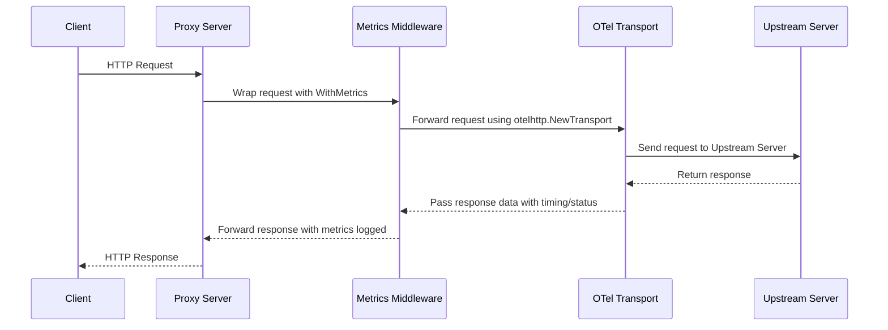

# OpenTelemetry Reverse Proxy (otel-rev-proxy)

OpenTelemetry is a high-performance reverse proxy designed to seamlessly integrate with OpenTelemetry for distributed tracing, metrics, and logging. It acts as an intermediary between clients and backend services, enhancing observability by automatically capturing telemetry data from incoming and outgoing requests.

## Key Features

- **Built-in OpenTelemetry support** – Automatically collects traces, metrics, and logs.
- **Efficient request routing** – Routes and traffic to backend service.
- **Extensible architecture** – Easily integrates with existing observability stacks.
- **Minimal overhead** – Optimized for performance and low latency.
- **Security & reliability** – Supports TLS, rate limiting, and request validation.

## Use Cases

- Observability-first microservices infrastructure.
- Debugging and performance monitoring of distributed systems.
- Centralized telemetry collection for API gateways and service meshes.

## Sequence Diagram(s)

